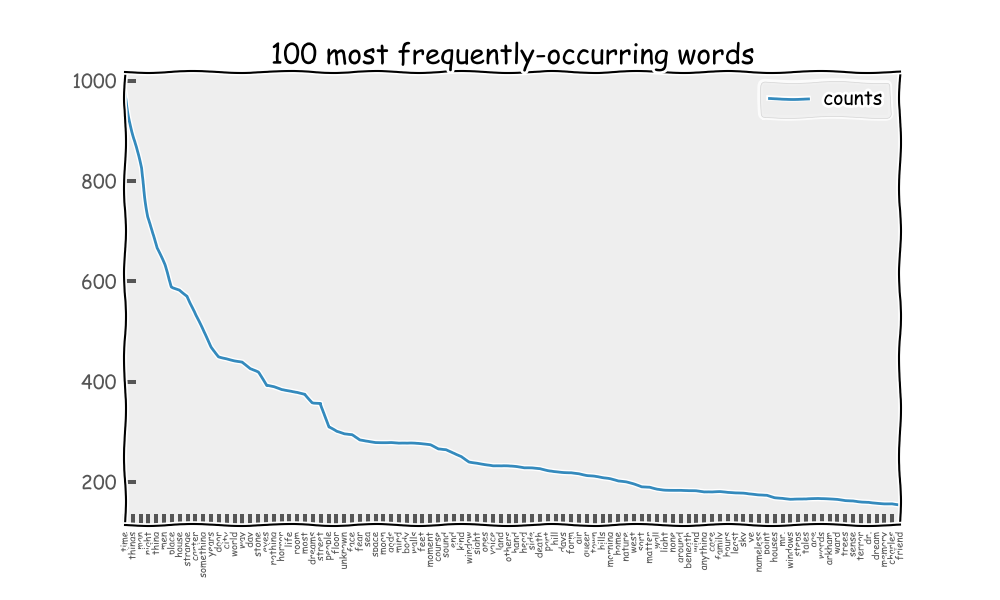

# Classifying and ranking text using NLTK and The Nameless Horror

This is a small demo showing basic NLTK functionality (tokenizing, classifying, frequency counting), using [The Collected Works of H.P. Lovecraft](http://gutenberg.net.au/ebooks06/0600031h.html) as a corpus.
The code ought to be fairly self-explanatory.
The script will write a file, `results.pickle`, to your current working directory upon its first run, because classification is quite slow. This allows you to tune the tag set to be used for frequency counting without having to wait for re-classification each time. The script is designed to be run interactively from e.g. an IPython (using `--pylab` to allow figure generation) instance, hence the final comment regarding resizing. If you wish to save the resulting graph, use `plt.savefig(filename, **kwargs)`.

## Requirements

- Requests
- BeautifulSoup4
- NLTK
- Matplotlib 1.4.x

You may have to install Matplotlib from Github, as 1.4 has not been released as of late July 2013, and you'll need it for the XKCD-style graphs.

## License

MIT, copyright Stephan Hügel 2013

